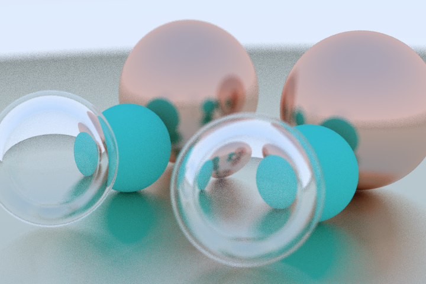
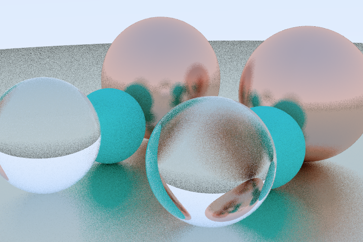
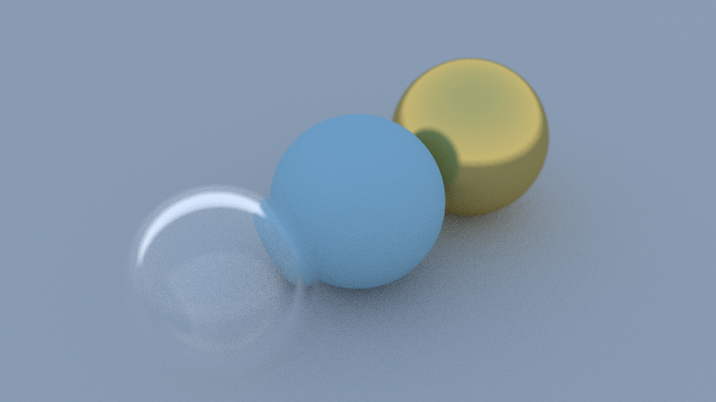
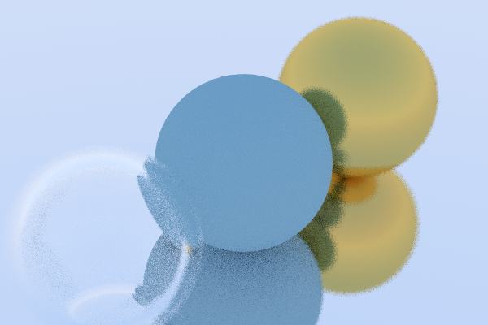

# traceur 🔭

Traceur (pronounced like _trace_ + _connoisseur_) is an experimental path tracing 3D renderer written in [Ink](https://github.com/thesephist/ink), a dynamically-typed, functional programming language I created. You can read more about Traceur in my [blog post about it](https://dotink.co/posts/traceur/) on the Ink language blog.

There is also a direct and well-optimized Web and JavaScript port of Traceur at [thesephist/traceur-web](https://github.com/thesephist/traceur-web). If you want a taste of how path tracing in Traceur works, you can try an interactive demo at [traceur-web.thesephist.repl.co](https://traceur-web.thesephist.repl.co/).

## Motivation

Traceur isn't meant to be a path tracer for everyday use or for generating large, high quality renders. It's more of a proof of concept for using Ink in a substantial, nontrivial project, and it was my introduction into physically based rendering and path tracing.

Traceur has two goals.

1. **Learning**. I built the initial version of Traceur following the excellent and friendly [Ray Tracing in One Weekend](https://raytracing.github.io/) guide, and much, though not all, of the code in Traceur is a port of the C++ code explained in the guide. My primary goal with Traceur was a gentle and solid introduction to physically based rendering and path tracing.
2. **Testing Ink on a non-trivial and interesting project.** Traceur is only the third non-trivial project written in Ink, following [Polyx](https://github.com/thesephist/polyx) and [inkfmt](https://github.com/thesephist/inkfmt). As a part of building Traceur, I created conventions for how to organize Ink projects of this size, around `lib` for first-party shared libraries, `vendor` for third-party or stdlib dependencies, and `test` for tests, with main programs residing at the root of the project, like `traceur.ink`. Traceur is also the most substantial Ink project to date in the level of compute **performance** it requires. Ink is designed quite poorly for numerical workloads, so it doesn't fare well, but Traceur demonstrated an upper limit in the performance gap that can exist between low level, compiled languages and Ink's standard Go-based interpreter.

## Design and progress

Traceur is a straightforward path tracer that follows rays cast (with some pseudorandom noise) from the camera lens through each pixel in the viewport. It finds intersections and hit points on spheres, the only shape currently supported, analytically. Following the path tracing guide above, Traceur currently supports:

- Spheres and "planes" approximated with large spheres
- Background lighting, soft shadows
- Refractive and reflective surfaces
- Arbitrary object and camera positions with full 6DOF
- Focus blur
- Saving to a `.bmp` bitmap image format

### Future work

There's a few things I'd like to explore in either this project or traceur-web going forward.

- Triangle mesh and rectangular shapes
- Volume rendering, with support for translucent and transparent objects
- Ray marching numerically, not analytically, for more complex surfaces
- Noisy textures
- Lighting and object-based illumination, including accurate caustics

## Usage

Make sure you have Ink installed on your system, and `inkfmt` installed for `make fmt`.

- `make` (or `make run`) to run the path tracer. The output file defaults to `./out.bmp`
- `make check` to run all unit tests
- `make fmt` to autoformat all files with [inkfmt](https://github.com/thesephist/inkfmt), if you have it installed

## Resources and further reading

- Ray Tracing in One Weekend: [https://raytracing.github.io/](https://raytracing.github.io/)
- Kevin Beason's mini path tracer projects:
    - smallpt: [https://www.kevinbeason.com/smallpt/](https://www.kevinbeason.com/smallpt/)
    - livecoding stream: [https://www.youtube.com/watch?v=PGuxfdyaKJU](https://www.youtube.com/watch?v=PGuxfdyaKJU)
- _The Ray Tracer Challenge_: [https://www.amazon.com/Ray-Tracer-Challenge-Test-Driven-Renderer/dp/1680502719](https://www.amazon.com/Ray-Tracer-Challenge-Test-Driven-Renderer/dp/1680502719)
- Haskell Ray Tracer: [https://wiki.haskell.org/The_Monad.Reader/Issue5/HRay:_A_Haskell_ray_tracer](https://wiki.haskell.org/The_Monad.Reader/Issue5/HRay:_A_Haskell_ray_tracer)

## Sample renders

Full glass orb with no focus blur on the scene

Lambertian material as the floor

More samples (top), Fewer samples (bottom) on the same scene

